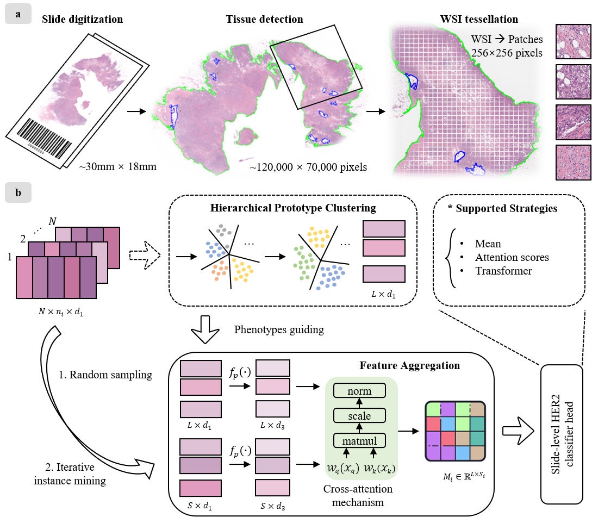
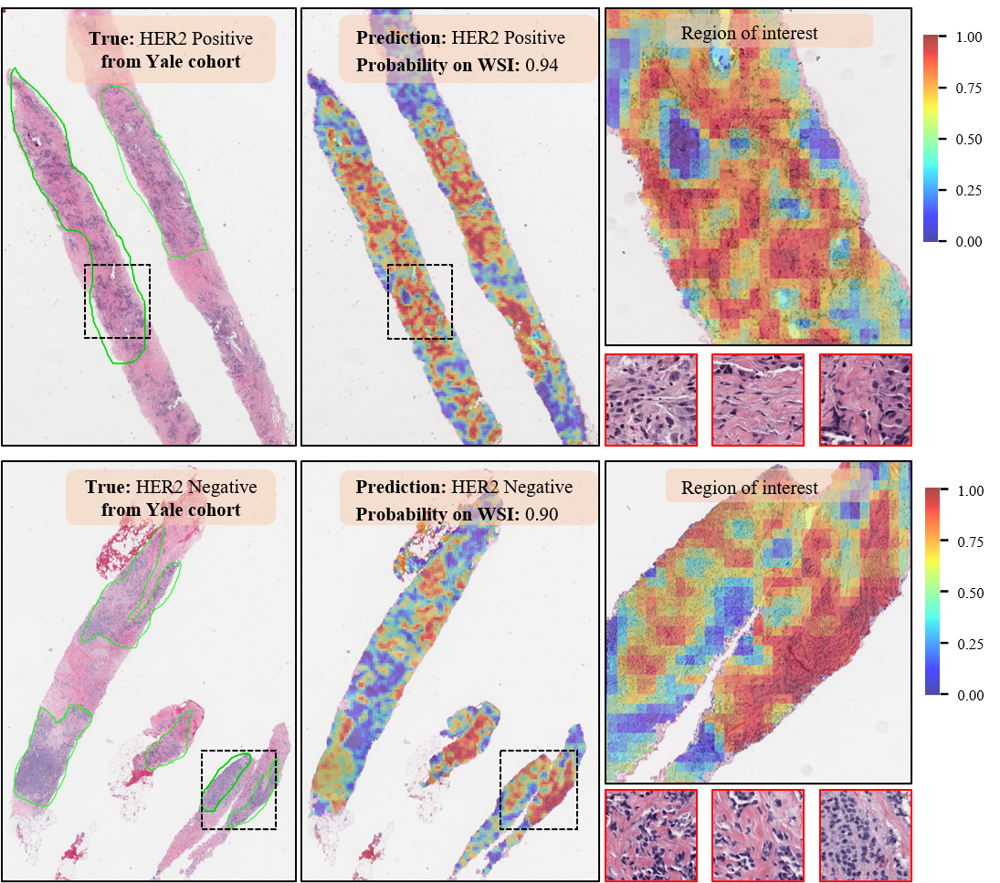

# PhiHER2

The offical implementation of **PhiHER2: Phenotype-guided weakly supervised model for HER2 status prediction from pathological images**.




## Description

Description will be released soon.

## Unique capability of PhiHER2



Detailed capability of our model will be released soon.


# User Guide

## 1. Requirements and installation

### Operating systems

The codes have been implemented on Ubuntu 22.04 LTS. The installation in other operation systems (Windows or MAC) should be cautious due to python packages.

### Packages and version

The packages required have been provided in the file [requirements.txt](requirements.txt)

### Installation

<!-- PhiHER2 is implemented by Python 3.8 and PyTorch 2.0.  -->
To install the environment, you can run the command in the terminal:

```shell
conda create --name <env_name> python=3.8
conda activate <env_name>
pip install -r requirements.txt
```

NOTING: The codes require package `openslide python`, but its installation is different between Linux and Windows. Please follow the [offical documentation](https://openslide.org/api/python/) to install and import it in python to make sure it can work correctly. 

`timm` library should also be installed as described in [TransPath](https://github.com/Xiyue-Wang/TransPath).

## 2. Data 

All data used in this work are publicly available. 

The HEROHE dataset derived from the ECDP2020 challenge can be obtained from [https://ecdp2020.grand-challenge.org/Dataset/](https://ecdp2020.grand-challenge.org/Dataset/). Detailed information can also be access.

The Yale HER2 cohort is available at [The Cancer Imaging Archive Public Access](https://wiki.cancerimagingarchive.net/pages/viewpage.action?pageId=119702524#119702524aceef3fce2344b60b43de4c69f8459de). Data with Version 3 is used.


## 3. Train, Evaluation and Inference

### Pipeline

The workflow is based on weakly supervised learning MIL approach. It includes: 

> Take **HEROHE dataset** as an example below

(1) whole slide images processing 

```shell
datapath="/mnt/DATA/HEROHE_challenge/TrainSet/"
patchpath="/home/cyyan/Projects/HER2proj/results/HEROHE_train_1WsiPatching_40x"

echo "WsiPatching..."
python s1_WsiTiling.py \
	-s  $datapath \
	-d  $patchpath \
    -ps 256 \
    -ss 256 \
	--patch \
	--bgtissue \
	--stitch
```

(2) feature representation

```shell
datapath="/mnt/DATA/HEROHE_challenge/TrainSet/"
patchpath="/home/cyyan/Projects/HER2proj/results/HEROHE_train_1WsiPatching_40x"
featspath="/home/cyyan/Projects/HER2proj/results/HEROHE_train_2FeatsCCL_40x"

tocsvpath=$patchpath"/process_list_autogen.csv"
cclmodelpth="/home/cyyan/Projects/HER2proj/models/CCL_best_ckpt.pth" # CCL_best_ckpt.pth ctranspath.pth

echo "FeatsExtraction..."
python s2_FeatsExtracting.py \
	--feat_to_dir $featspath \
	--csv_path $tocsvpath \
	--h5_dir $patchpath \
    --retccl_filepath $cclmodelpth \
	--slide_dir $datapath \
	--slide_ext ".svs" \
	--batch_size 320 \
	--float16
```

NOTING: Pre-trained **RetCCL** model can be borrowed from [HERE, Google Drive RetCCL model](https://drive.google.com/drive/folders/1AhstAFVqtTqxeS9WlBpU41BV08LYFUnL)


(3) Hierarchical prototype clustering

Prototypes clustering is only conducted on training data in case of data leakage. So we MUST divided data into **train-val-test** or **corss-validation** splits before running Hierarchical prototype clustering. 

Cases splitting script should be run as below:

```shell
featspath="/home/cyyan/Projects/HER2proj/results/HEROHE_train_2FeatsCCL_40x"

splitspath="/home/cyyan/Projects/HER2proj/results/HEROHE_3CaseSplits"
csvinfopath="/mnt/DATA/HEROHE_challenge/HEROHE_TrainGTinfo.csv"
labelname="her2status"

echo "N times train-val-test mode split."
python s3_CaseSplitting.py \
    --task_name $labelname \
	--csv_info_path $csvinfopath \
	--split_to_dir $splitspath \
    --times 5 \
	--kfold 0 \
	--val_frac 0.2 \
	--test_frac 0 \
	--label_column_name $labelname \
	--label_list "Negative" "Positive"\
    --slide_featspath $featspath\
	--seed 2020

```

NOTING: HEROHE dataset has indepedent test set, so we set `0.2` to `val_frac` and `0.0` to `test_frac`.

If `s3_CaseSplitting.py` is need to be run for **Yale cohort**: 

```shell
featspath="/home/cyyan/Projects/HER2proj/results/Yale_2FeatsCCL"

splitspath="/home/cyyan/Projects/HER2proj/results/Yale_3CaseSplits"
csvinfopath="/home/cyyan/Projects/HER2proj/data_ModPath_HER2_v3/Yale_HER2status.csv"

labelname="her2status"

echo "N times K folds cross validation mode split."
python s3_CaseSplitting.py \
    --task_name $labelname \
	--csv_info_path $csvinfopath \
	--split_to_dir $splitspath \
    --times 5 \
	--kfold 5 \
	--val_frac 0 \
	--test_frac 0.2 \
	--label_column_name $labelname \
	--label_list "Negative" "Positive"\
    --slide_featspath $featspath\
	--seed 2020
```

`val_frac` is set to `0.0` and `test_frac` is `0.2`. This means that we splitted 20% data for testing and the remained is for `kfold` cross-validation. 

Then you can run the `s4_HPcluster_prototypes.py` script.

```shell
python s4_HPcluster_prototypes.py --config_file cfgs/HEROHE.yaml
```

The config hyperparameters file `cfgs/HEROHE.yaml` can be refered to [HERE](#parameter-configs)

(4) PhiHER2 MIL **model training**

```shell
python s4_ModelTraining.py --config cfgs/HEROHE.yaml
```

or 

```shell
sh run_train_HER2status.sh # write train-logs to the local.
```

`cfgs/HEROHE.yaml` contains the config hyper-parameters for model training [HERE](#parameter-configs). 

NOTING: Users can also observe loss curves and changes in indicators in **Browser (eg. localhost:6006)** during model training by **tensorboard**.

```shell
cd ${results_dir}${datasource}${task}${exp_code}
tensorboard --logdir . --port=<your port, eg. 6006>
```


### Parameter configs

A hyper-parameters-configured example for **HEROHE dataset** is given below

```YAML
CKPTS:
  datasource: HEROHE
  task: "HER2status"  # task name
  exp_code: debug  # set exp name

  data_root_dir: /home/cyyan/Projects/HER2proj/results/HEROHE_train_2FeatsCCL_40x # features representation data directory for training data
  csv_info_path: "/mnt/DATA/HEROHE_challenge/HEROHE_TrainGTinfo.csv" # csv file wih slide info and her2status info.
  wsi_root_dir: /mnt/DATA/HEROHE_challenge/TrainSet/ # wsi root path

  indep_data_root_dir: /home/cyyan/Projects/HER2proj/results/HEROHE_test_2FeatsCCL_40x # features representation data directory for indepedent test data
  indep_csv_info_path: "/mnt/DATA/HEROHE_challenge/HEROHE_TestGTinfo.csv" # indepedent test csv file wih slide info and her2status info.
  split_dir: /home/cyyan/Projects/HER2proj/results/HEROHE_3CaseSplits/her2status_TrainValTest # casesplitting root path
  results_dir: "/home/cyyan/Projects/HER2proj/models" # results directory for model, logs, and test evaluation results
  cluster_path: "/home/cyyan/Projects/HER2proj/results/HEROHE_4APCluster40x" # root path for cluster prototype embeddings on splits
  cfg_to_name: "params_setting.txt" # hyper-params file for saving

TRAIN:
  model_type:  ProtoTransformer # ['ProtoTransformer', 'CLAM', 'ProtoMIL', 'ABMIL', 'Transformer'] type of model 
  encoding_dim:  2048 #'patch encoding dim'
  model_size: ccl2048  # ['resnet_small', 'ViT_small', 'ccl2048']' size of model, does not affect mil', only for ABMIL and CLAM

  top_num_inst:  # sampling `top_num_inst` instances in model forward according to attention scores, only for ABMIL.
  top_num_inst_twice: 500 # None will cover all samples, the number for iterative sampling 
  num_perslide: 5000 # None will cover all samples, the number for random sampling 
  n_classes: 2 # 'number of classes '
  label_col: HER2status # label column name
  labels_list: ["Negative", "Positive"]
  loss_func: CE # slide-level classification loss function

  log_data: True # log data using tensorboard
  weighted_sample: True # 'enable weighted sampling
  
HyperParams:
  max_epochs: 1000 # 'maximum number of epochs to train (default: 1000)'
  batch_size: 1 # batch size commonly set to 1 for MIL, we utilized Gradient Accumulation below.
  gc: 32 # 'Gradient Accumulation Step.' HERE, Gradient Accumulation is equal to common batch size.
  lr: 0.0001 # 'learning rate (default: 0.0001)'
  optim: adam  # optimizer, adam sgd adamW radam Lamb
  scheduler: LinearLR # optimizer scheduler [CosineAnnealingLR CyclicLR LinearLR OneCycleLR StepLR]
  drop_out: 0. # a float num, enable dropout (p=0.25)'
  early_stopping: True  # enable early stopping

  reg: 0.00001 # 'weight decay (default: 1e-5)'
  lambda_reg: 0.00001 # 'L1-Regularization Strength (Default 1e-5)'

CROSSVALIDATAION:
  times: 5 # number of times (default: 5)
  t_start: -1 # start time (default: -1, last time)
  t_end: -1 # end time (default: -1, first time)
  k: 1 # number of folds (default: 10)
  k_start: -1 # start fold (default: -1, last fold)
  k_end: -1 # end fold (default: -1, first fold)

CLUSTER: # for Hierarchical prototype clustering
  preference: 0 # preference for AP cluster alg.
  damping: 0.5 # damping for AP cluster alg.
  lamb: 0.25 # lamb params for AP cluster alg.

COMMON:
  gpu: '0'
  seed: 2020 # 'random seed for reproducible experiment (default: 2020)'
  workers: 8  # data loader workers
```

You can also set your own configs with the comment guidance.


### Evaluation

The training scripts above will generate the evaluated quantitative results into `csv`-format tables. We reported these results in our paper.

We also implemented a script for individual quantitative evaluation. You can execute it by modifying the specific config parameters.

```shell
python s5_Evaluation.py
```

### Inference

A new WSI case can be directly inferred. And the WSI-level attention heatmap will be generated by our model. 

You could refer to specific parameters in [heatmap_cfgs.yaml](cfgs/heatmap_cfgs.yaml) for guidance. Then run: 

```shell
python s6_HeatmapVis.py --config_file cfgs/heatmap_cfgs.yaml 
```

or you can set parameters directly, 

```shell
python s6_HeatmapVis.py --config_file cfgs/heatmap_cfgs.yaml --opts \
        data_dir <your_slide_rootpath> \
        spec_slide <list of slidenames, eg. ['1.svs', '3.svs']> \
        slide_ext <format of slide, eg. .svs> \
        ckpt_path <pre-trained model names, eg. xx/s_1.pt> \
        cluster_path <pre-clustered prototypes, eg. xx/t0_1.pt>
```

### Trained models weights

The pre-trained weights and pre-clusterd prototypes embeddings of our model on the HEROHE dataset and the Yale cohort can be downloaded in [HERE, Password: `jV5.mB2!qD`](https://mailnankaieducn-my.sharepoint.com/:f:/g/personal/1120220274_mail_nankai_edu_cn/EiO6Ji1eZwtJo3l2N9_eMLkBTwlj3gUf9iQmsG-Ru8pdlw?e=lFdeg0). The weights can be used to reproduce the results in our paper. Also, It has the capability of inferring on new H&E WSIs.

## Acknowledgements

Our code is developed on the top of [CLAM](https://github.com/mahmoodlab/CLAM). Part of the code is borrowed from [HistoBistro](https://github.com/peng-lab/HistoBistro) and [PMIL](https://github.com/Zero-We/PMIL).

(cheers to the community as well)

## Contact

If you have any problems, just raise an issue in this repo.